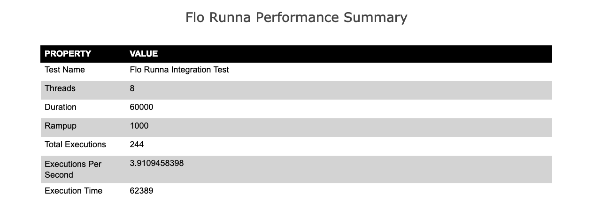
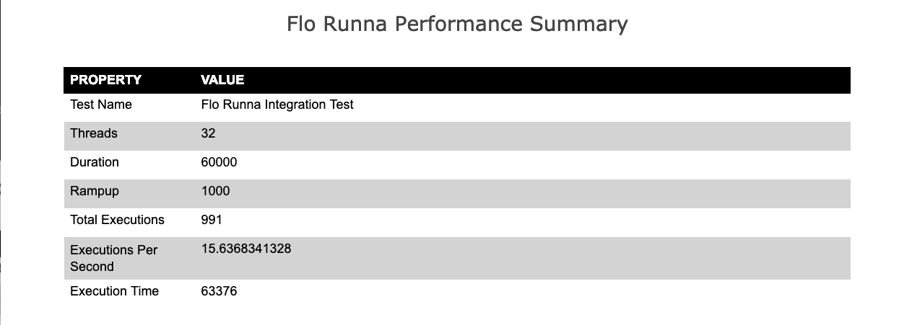
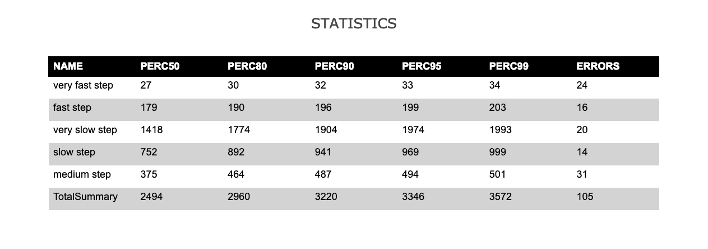
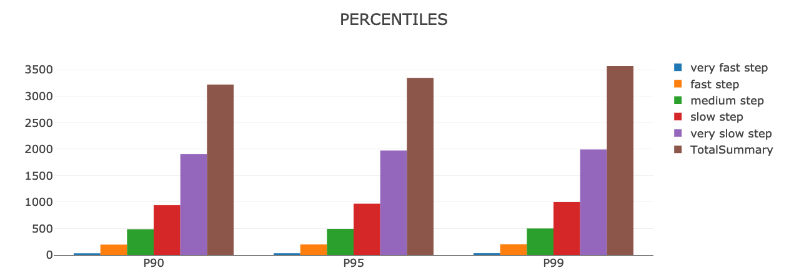
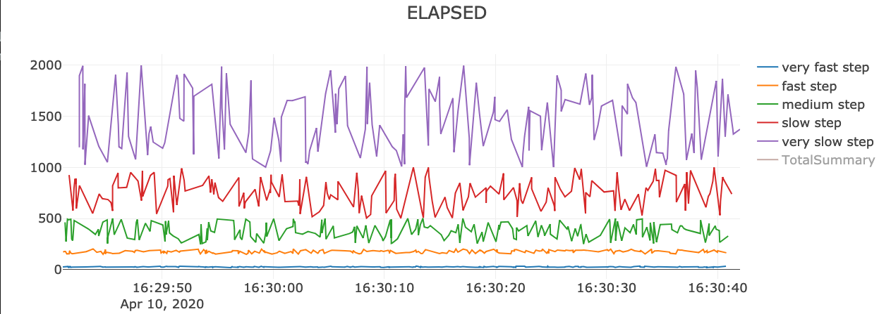
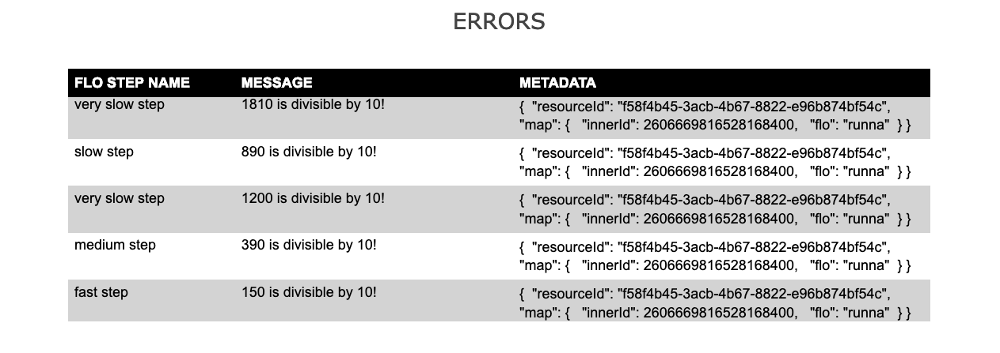
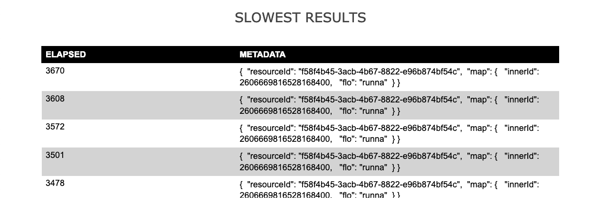

# Flo Runna
Library to convert functional [Spock](http://spockframework.org/) tests into Load tests.

## Table of Contents
[Description](#description)

[Maven](#maven)

[How to create a Load Test](#how-to-create-a-load-test)

[Error Handling](#error-handling)

[Parallels](#parallels)

[Test Output](#test-output)

## Description

Flo Runna allows us to specify a workflow to execute in parallel to induce a controlled amount of load.
For each part of the workflow, it will capture common performance metrics (such as percentiles) for the execution.

The idea for this tool came from the need for us to quickly write performance tests when we have already written functional tests.
We had already written our tests in Spock. We have our own Http Clients that are used in the tests, and created
methods to execute the steps needed for the functional workflows. To rewrite these tests in [JMeter](https://jmeter.apache.org/)
or [Gatling](https://gatling.io/) 
would have been a tremendous effort. Flo Runna allows us to reuse the existing code in our functional tests
and run them as performance tests.

The magic behind Flo Runna is the execution of a chain of steps in a workflow in parallel, each step being a Closure.
Since we are creating Closures,
the steps can have any implementation we like. This means we can use any Http library of our choosing. We can use
OkHttp, Retrofit, HttpBuilder, etc. Since Groovy can run Java and Kotlin code, the libraries we import can also be written in
those languages. Perhaps we may have written some tests using KSpec, Kotlin Test, or JUnit. Any classes written for those tests in Kotlin, Groovy, or Java
can then be imported into a Spock test and used with Flo Runna.

For those familiar with the concepts of [Cucumber](https://cucumber.io/) or [SpecFlow](https://specflow.org/), 
these Gherkins force the test writer to create functions to bind to English sentences.
These steps are then reused in different test cases.
When writing any functional integration tests, it is recommended to write methods to execute any step needed (like Gherkins), so that they 
can be reused across different test cases.  So, in cases where we have written reusable code for our functional tests,
those libraries can then be reused in our Flo Runna performance tests.

## Maven
TODO. Publish to Maven Central and put instructions here on how to import using gradle and maven.

## How to create a Load Test
In this example, we will hypothetically assume that we have a client library already written.

### Initialize a FloRunna object
There are 2 ways to initialize a FloRunna object.

In this example, we hardcode the threads, rampup, and duration.
```groovy
int threads = 8
long duration = 180000
long rampup = 60000
String testName = "Flo Runna Integration Test"
FloRunnaSettings settings = new FloRunnaSettings(threads, duration, rampup, testName)
FloRunna floRunna = new FloRunna(settings)
```

In this example, the properties will come from system properties.
```groovy
String testName = "Flo Runna Integration Test"
FloRunnaSettings settings = new FloRunnaSettings(testName)
FloRunna floRunna = new FloRunna(settings)
```
The test would then have to be run from command line as follows
```
 ./gradlew test -Dthreads=16 -Dduration=300000 -Drampup=60000 --tests *FloRunnaIntegrationTest
```

### Build and execute a WorkFlo
The `execute` method in [FloRunna](./src/main/groovy/co/tala/performance/flo/FloRunna.groovy) accepts a `Closure<WorkFlo>` parameter. The parameter of the
Closure is a [WorkFloBuilder](./src/main/groovy/co/tala/performance/flo/WorkFloBuilder.groovy).
This is what we use to build our workflow. A [WorkFlo](./src/main/groovy/co/tala/performance/flo/WorkFlo.groovy)
is a sequence of [FloStep](./src/main/groovy/co/tala/performance/flo/FloStep.groovy)s that will be executed
in order on a thread. A `FloStep` is essentially a Closure with a name.
Here is an example, assuming that we have already written several classes to help us with our functional
Spock tests, we can reuse that code in our performance Spock tests. The Http client in the example below is
made up for example purposes. This client could have been written in any Java based library.

```groovy

given:
    FloRunna floRunna = new FloRunna(new FloRunnaSettings(8, 3000, 1000,"Flo Runna Integration Test"))

when:
    def results = floRunna.execute { WorkFloBuilder workFloBuilder ->
        CreateAccountResponse createAccountResponse = null
        String userId = ""
        
        workFloBuilder
                .addStep("create account") {
                    createAccountResponse = client.createAccount()
                    assert createAccountResponse.statusCode == 201
                    assert createAccountResponse.body.userId != null
                    userId = createAccountResponse.body.userId
                }
// Logging metadata will be helpful if we want to troubleshoot when a test fails or takes too long.
// We can set any metadata we like. This could include important information such as a userId.
// This data can then be used when querying the logs of the service under test.
                .setMetadata([userId: userId])
                .addStep("get user") {
                    GetUserResponse getUserResponse = client.getUser(userId)
                    assert getUserResponse.statusCode == 200
                    assert getUserResponse.body.userId == userId
                }
                .addStep("delete user") {
                    DeleteUserResponse deleteUserResponse = client.deleteUser(userId)
                    assert deleteUserResponse.statusCode == 204
                }
                .build()
    }

then:
    // If any exceptions are thrown in the WorkFlo, they will be handled and all will be rethrown after the entire test run is complete.
    // So, the test run will fail if any exception is thrown.
    verifyAll(results){
            // Verify percentiles
            it["create account"].perc95 < 200
            it["get user"].perc95 < 200
            it["delete user"].perc95 < 200
    }
```

In the example above, the workflow will do the sequence of steps in parallel on many threads.
Every thread would have different userIds.

What if we just wanted to test the endpoint `get user`?
We can take the `create account` step outside of the WorkFlo and have the user created before the
performance test is executed. This would have a similar effect as the setup stage in [JMeter](https://jmeter.apache.org/).
One user is created, and the `Workflo` only consists of one `FloStep`, results in only load testing
the endpoint `get user`.

```groovy

given:
    FloRunna floRunna = new FloRunna(new FloRunnaSettings(8, 3000, 1000,"Flo Runna Integration Test"))
    //Create user in the given phase
    CreateAccountResponse createAccountResponse = client.createAccount()

    assert createAccountResponse.statusCode == 201
    assert createAccountResponse.body.userId != null
    String userId = createAccountResponse.body.userId

when:
    def results = floRunna.execute { WorkFloBuilder workFloBuilder ->
        workFloBuilder
                .setMetadata([userId: userId])
                .addStep("get user") {
                    GetUserResponse getUserResponse = client.getUser(userId)
                    assert getUserResponse.statusCode == 200
                    assert getUserResponse.body.userId == userId
                }
                .build()
    }

then:
    verifyAll(results){
            // Verify percentiles
            it["get user"].perc95 < 200
    }
```

## Error Handling
The class [Parallels](./src/main/groovy/co/tala/performance/async/Parallels.groovy) is responsible for managing all
threads and exceptions. If any Exception is thrown, it will be caught and stored. When the test run is complete, all exceptions
will be rethrown.

When an Exception is thrown in the middle of the WorkFlo execution, any remaining steps in the workflow will not execute, 
since an error occurred in the previous step. This is to prevent the test thread from continuing when part of the
workflow was not satisfied.  The result of the execution will still be saved in the `Total Summary`. The `Total Summary`
will log which step failed with the error message and metadata of the execution.

## Parallels
The `Parallels` class is public, and can also be used in functional Spock tests for running several commands in parallel to speed up 
the tests. If there are several requests that need to be sent as part of the test setup that don't need to complete
in order, this library can run them all in parallel. Call `Parallels.waitAll()` to wait for all threads to complete
before executing code that needs that setup.

This example below will run 4 hypothetical synchronous methods in parallel (now async) and wait for all to complete.
```groovy
new Parallels()
    .runAsync { method1() }
    .runAsync { method2() }
    .runAsync { method3() }
    .runAsync { method4() }
    .waitAll()
```
Let's say there is a scenario where we need to create a large number of new users. We can execute a `createUser()` method several
times in a loop using `Parallels.runAsync` to created them faster in parallel than one at a time.

## Test Output

The Html outputs use these free and open source libraries:
 
* [plotly.js](https://github.com/plotly/plotly.js) for generating chart renderings.
* [jQuery](https://github.com/jquery/jquery) for reading all json data.

**All Examples below use output from the sample [Flo Runna Integration Spec](./src/test/groovy/co/tala/performance/flo/FloRunnaIntegrationSpec.groovy)**

To see these example outputs, run the test suite. This can be done with the following gradle command:
```
./gradlew test
```

When the test is complete, several json files will be written to `/build/flo-runna-reports/{testName}`, where `testName`
is the `testName` param passed to `FloRunnaSettings`

A json file is written for each `FloStep`, with all performance metrics of that `FloStep`.
An `index.html` is also written to this directory.

A json file is also written the for `TotalSummary`. Total Summary is the result for the entire workflo, as if it were run
as a single step, so that we can see the results for the overall workflow. This does not mean that the addition
of all 95 percentiles will be equal to the 95 percentile for the Total Summary.

Here is an example of the metrics saved in `fast step.json`. If an error occurs on any step, it will be stored in
`results`.  Several objects in `results` are omitted since it is very large.

```json
{
    "testName": "Flo Runna Integration Test",
    "floStepName": "fast step",
    "threads": 16,
    "duration": 30000,
    "rampup": 1000,
    "perc50": 176,
    "perc80": 190,
    "perc90": 196,
    "perc95": 198,
    "perc99": 200,
    "totalExecutions": 226,
    "executionsPerSecond": 6.8749429623,
    "startTime": "2020-04-10T21:26:50.696889Z",
    "endTime": "2020-04-10T21:27:23.569852Z",
    "executionTime": 32873,
    "executionId": "502c2607-1eb0-490e-8639-a9b0bc5ab061",
    "floStepOrder": 1,
    "results": [
        {
            "elapsed": 182,
            "metadata": {
                "resourceId": "29812d46-0ca4-4338-badc-9dd6be959f56",
                "map": {
                    "innerId": 4715718290194202521,
                    "flo": "runna"
                }
            },
            "startTime": "2020-04-10T21:26:50.773892Z",
            "endTime": "2020-04-10T21:26:50.955925Z",
            "resultId": "9c2c7bb7-5878-4276-bb78-5bc568bd4808"
        },
        {
            "elapsed": 166,
            "metadata": {
                "resourceId": "29812d46-0ca4-4338-badc-9dd6be959f56",
                "map": {
                    "innerId": 4715718290194202521,
                    "flo": "runna"
                }
            },
            "error": {
                "floStepName": "fast step",
                "message": "160 is divisible by 10!"
            },
            "startTime": "2020-04-10T21:26:50.794320Z",
            "endTime": "2020-04-10T21:26:50.960757Z",
            "resultId": "975e7ab1-9a7b-46ab-9444-49dd02e8e920"
        }
    ]
}
```

The `index.html` file provides the following data:

#### **A summary of the overall results and settings**



#### **Notice that when we increase the number of parallel threads, the number of executions increase**



#### **Statistics table for all steps, including number of errors**



#### **Bar Charts for the 90th, 95th, and 99th Percentiles**


#### **Elapsed Timeline**



#### **Errors Table with Error Messages and Corresponding Metadata**



#### **SlowestResults Table. This is taken from `TotalSummary.json`**

